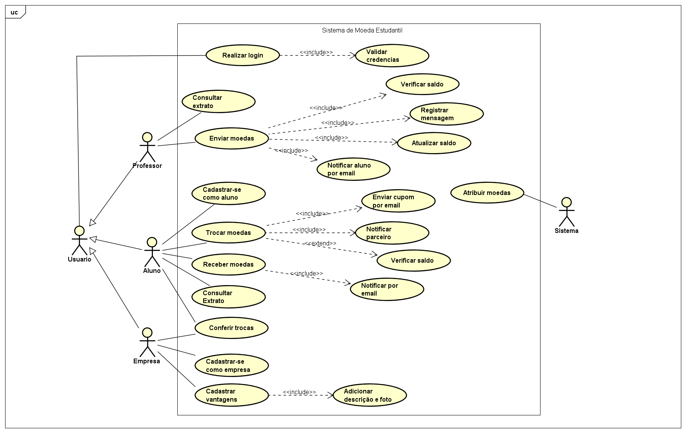
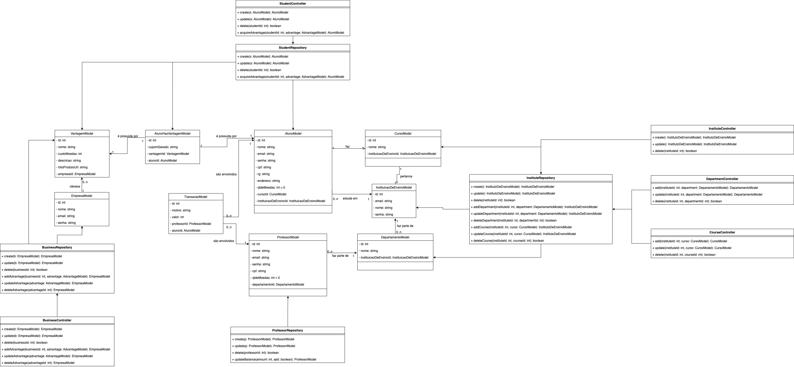
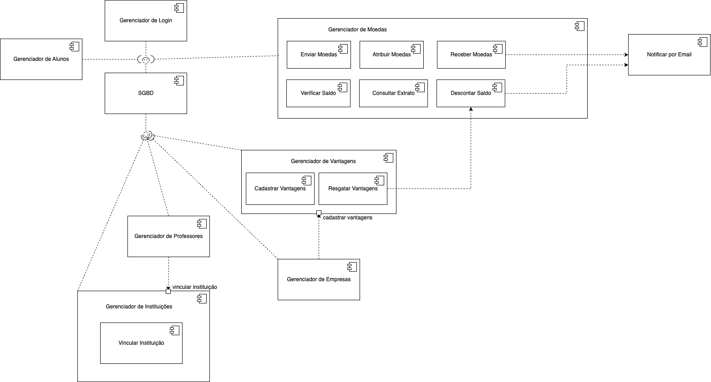

# EduCoin - Sistema de Moeda Estudantil

Aplicação para reconhecimento do mérito estudantil por meio de uma moeda virtual distribuída por professores, que pode ser trocada por vantagens em empresas parceiras.

## Alunos integrantes da equipe
* Érica Alves dos Santos
* Joana Iuna de Morais
* Kaio Henrique Oliveira da Silveira Barbosa
* Kimberly Liz Spencer Lourenço

## Professores responsáveis
* Rodrigo de Carvalho

## Funcionalidades Principais

- Cadastro e autenticação de alunos, professores e empresas.
- Distribuição de moedas pelos professores com histórico de transações.
- Notificações por e-mail em operações de recebimento e troca de moedas.
- Troca de moedas por vantagens cadastradas por empresas parceiras.

## Diagrama de Caso de Uso

## Histórias de Usuários 

| **ID** | **História de Usuário** |
|-----|-------------------------|
| US01 | *Como aluno, eu quero me cadastrar no sistema informando meus dados pessoais (nome, email, CPF, RG, endereço, instituição de ensino e curso), para ingressar no sistema de mérito.* |
| US02 | *Como aluno, eu quero consultar meu extrato contendo o saldo de moedas e o histórico de transações (recebimento e trocas), para acompanhar minhas atividades e benefícios no sistema.* |
| US03 | *Como professor, eu quero consultar meu extrato de transações (envio de moedas), para acompanhar minhas operações realizadas e o saldo disponível.* |
| US04| *Como professor, eu quero enviar moedas para um aluno, informando a quantidade e uma mensagem justificativa, para reconhecer e incentivar seu bom comportamento.* |
| US05| *Como professor, eu quero que o sistema adicione automaticamente 1.000 moedas ao meu saldo a cada novo semestre, para acumular saldo e poder distribuir o reconhecimento de forma contínua.* |
| US06| *Como aluno, eu quero receber notificações por email quando receber moedas ou realizar trocas, para ser informado imediatamente sobre as transações realizadas.* |
| US07| *Como aluno, eu quero trocar as moedas acumuladas por vantagens ofertadas no sistema (descontos, produtos, etc.), para usufruir dos benefícios disponíveis.* |
| US08| *Como empresa parceira, eu quero me cadastrar no sistema informando meus dados empresariais, para poder oferecer vantagens aos alunos.* |
| US09| *Como empresa parceira, eu quero cadastrar vantagens, incluindo uma descrição detalhada, foto e o custo em moedas de cada oferta, para que os alunos possam resgatar os benefícios.* |
| US10| *Como empresa parceira, eu quero ser notificada por email quando um aluno resgatar uma vantagem, para confirmar a transação e preparar o atendimento necessário.* |

## Diagrama de Classes

## Diagrama de Componentes

## Tecnologias

 - Java
 - Spring Boot
 - PostgreSQL

## Como Executar
